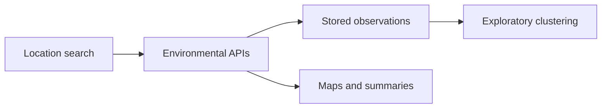

<div align="center">

**Weather, pollution, traffic, and wildfire context in one project.**

Next.js · TypeScript · Prisma · SQLite · Python

[Portfolio](https://harshil-prashant-shah.vercel.app/) · [LinkedIn](https://www.linkedin.com/in/harshilpshah/) · [Explore the code](#repository-guide)

</div>

---

## What this project explores

A location-based air-quality application paired with an exploratory research notebook. It combines environmental API responses, geographic views, stored observations, and clustering experiments.

## Application capabilities

- Search by place or coordinates.
- Display pollutant, weather, wildfire, and optional traffic context.
- Store observations with Prisma and SQLite.
- Explore clustering on the insights page.
- Generate rule-based or optional LLM advisory text.

The advisory and source-attribution outputs are prototype interpretations, not validated health assessments or causal measurements.

## Two complementary components

**Web application:** `src/` contains the Next.js interface and API routes.  
**Research notebook:** `Final_Year_Project.ipynb` contains exploratory data preparation, visualization, clustering, and predictive experiments.



## Repository guide

The instructions below describe the default `master` branch. Additional branches contain separate development work.

## Setup

1. **Install dependencies**
   ```bash
   npm install
   ```

2. **Configure environment**
   - Copy `.env.example` to `.env` 
   - Add your API keys. Use your own credentials; no keys are supplied. Add `GROQ_API_KEY` for AI advisories.

3. **Initialize database**
   ```bash
   npx prisma db push
   ```

4. **Run development server**
   ```bash
   npm run dev
   ```

5. Open [http://localhost:3000](http://localhost:3000)

## Project structure

```
├── src/
│   ├── app/
│   │   ├── api/
│   │   │   ├── search/     # Main search (AQI, weather, traffic, wildfire)
│   │   │   ├── cluster/    # K-Means clustering on stored data
│   │   │   └── llm-advisory/  # GROQ-based health advisory
│   │   ├── insights/       # Clustering dashboard
│   │   └── page.tsx        # Main search UI
│   ├── components/
│   │   ├── SearchBar.tsx
│   │   ├── ResultCard.tsx
│   │   └── MapView.tsx
│   └── lib/
│       ├── apis/           # External API clients
│       ├── health-advisory.ts
│       ├── pollution-causes.ts
│       └── utils.ts
├── prisma/
│   └── schema.prisma       # SQLite schema
└── .env
```

## API Keys (placeholders)

- **OPENWEATHER_API_KEY** — Required. Get at [openweathermap.org](https://openweathermap.org/api)
- **NASA_FIRMS_KEY** — For wildfire data. Get at [firms.modaps.eosdis.nasa.gov](https://firms.modaps.eosdis.nasa.gov/)
- **WAQI_TOKEN** — Optional. AQI source. [aqicn.org](https://aqicn.org/api/)
- **TOMTOM_KEY** — Optional. Traffic data. [developer.tomtom.com](https://developer.tomtom.com/)
- **GROQ_API_KEY** — Optional. LLM advisories. [console.groq.com](https://console.groq.com/)

## Verification and boundaries

API availability and credentials affect live results. Forecasting and source-attribution experiments have not been independently reproduced. Simulated fallbacks must be distinguished from observed measurements.

Notebook output cells were cleared and credential settings use environment variables. Identified personal seed data and tracked database files were removed from affected historical commits. Previously used credentials should still be rotated.

## Research

[Read the associated paper or manuscript](https://drive.google.com/file/d/1jRA-Yd8acJ9VW4yiHOxIWP4FD1hm4xkA/view). This reference was supplied by the author; publisher or Drive access conditions may apply. The paper and this repository may represent different project stages.

## About the author

**Harshil Prashant Shah** · MS in Management Information Systems, Texas A&M University.

[Portfolio](https://harshil-prashant-shah.vercel.app/) · [LinkedIn](https://www.linkedin.com/in/harshilpshah/) · [GitHub](https://github.com/harshilshah250504)

## Data and reuse

Local datasets, credentials, and third-party research PDFs are not included. No blanket license is granted over third-party material. Refer to the original sources for their terms before redistributing data or publications.
